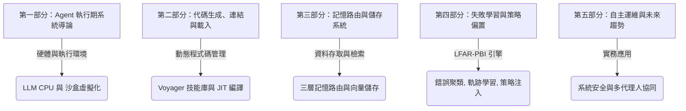

# 《LLM Agent 執行期與系統程式設計：從 Voyager 到 LFAR-PBI 失敗學習架構》
## 著：AI 系統程式研究組

---

## 📖 前言：系統程式的新時代

傳統上，**系統程式 (System Programming)** 的範疇圍繞著硬體、編譯器、組譯器、連結器、載入器以及作業系統的核心服務。我們學習如何將高階語言編譯成機器碼，並如何在實體 CPU 與記憶體上高效且安全地執行這些二進位指令。

然而，隨著**大型語言模型 (LLM)** 與 **自主代理人 (Autonomous Agents)** 的崛起，系統程式的定義正在發生深刻的範式轉移：
1. **LLM 成為新型態的 CPU**：自然語言成為頂層的高階指令，而 LLM 則是負責解析、推理與產生執行代碼的運算核心。
2. **動態程式碼生成作為指令集 (ISA)**：Agent 透過即時編寫 Python、Javascript 或 Shell 腳本來與底層系統互動。這些即時生成的程式碼，本質上就是 Agent 系統的動態機器指令。
3. **執行期虛擬機與沙盒**：為了安全地執行 Agent 產生的程式碼，系統程式必須提供隔離的沙盒（如 Docker、WASM 或受限的虛擬機器環境），這對應了傳統 OS 的進程隔離與保護模式。
4. **記憶與技能庫的連結加載**：Voyager 提出的 **Skill Library (技能庫)** 機制，本質上就是一個動態連結器 (Dynamic Linker) 與載入器 (Loader)，負責在執行期將預先編譯/寫好的程式碼模組動態鏈結到當前任務中。

本書旨在將**傳統系統程式**的經典理論，與以 **Voyager** 和 **LFAR-PBI (Learning-from-Failure Agent Runtime with Policy Bias Injection)** 為代表的 **LLM Agent 執行期架構**進行深度融合，為下一代的自主系統開發者提供一套系統化的實作指南。

---

## 🗂️ 本書章節目錄



---

## 📝 第一部分：Agent 執行期系統導論

### 第一章：Agent 系統程式概述
*   **1.1 什麼是 Agent 系統程式？**
    傳統系統程式負責連接軟體與物理硬體。Agent 系統程式則負責連接 **認知推理層（LLM）** 與 **物理執行層（OS/API/環境）**。它處理的是代碼的生成、動態載入、沙盒執行、例外捕獲以及回饋修正。
*   **1.2 LLM 作為 CPU 核心與指令週期 (Instruction Cycle)**
    我們將 LLM 的推理週期比擬為 CPU 的「取指、解碼、執行」週期：
    *   **Fetch (取指)**：從任務隊列或環境觀測中獲取當前 Task。
    *   **Decode (解碼)**：LLM 進行推理並規劃出所需的 Action（工具呼叫或程式碼段）。
    *   **Execute (執行)**：Executor（解譯器/沙盒）執行程式碼，並返回結果。
*   **1.3 傳統系統程式與 Agent 執行期對照表**

| 傳統系統程式概念 | Agent 執行期系統 (Voyager / LFAR-PBI) 對應 |
| :--- | :--- |
| **CPU 與指令集 (ISA)** | LLM 推理核心與工具/API 定義 (Tool Schema) |
| **編譯器與彙編器** | 代碼生成器 (Code Generator) 與 Prompt 模板編譯 |
| **連結器與載入器** | 技能管理器 (Skill Manager)，負責從 Skill Library 動態導入 JS/Python 函數 |
| **虛擬記憶體與頁表** | 外部上下文視窗 (Context Window) 與 RAG 知識庫映射 |
| **中斷與異常處理** | 執行期錯誤捕獲 (Runtime Error Capture) 與 Critic 評估修正機制 |
| **作業系統內核** | Agent 控制流框架 (如 LangGraph、Voyager 狀態機) |

### 第二章：沙盒執行環境與虛擬化技術
*   **2.1 沙盒安全與權限隔離**
    當 Agent 擁有自主撰寫並執行程式碼的能力時，為其提供安全的沙盒環境是系統程式設計的首要任務。如果沒有適當的隔離，Agent 產生的錯誤程式碼（例如死迴圈、記憶體洩漏或惡意指令）會直接損害宿主系統。
*   **2.2 Docker 容器化執行期設計**
    介紹如何利用 Python Docker SDK 為 Agent 建立拋棄式的執行容器。
*   **2.3 WebAssembly (WASM) 作為輕量級安全沙盒**
    探討將 JavaScript/Python 代碼編譯為 WebAssembly 字節碼並在受限 VM 中執行的優勢，以實現微秒級的冷啟動與絕對的記憶體安全。

---

## 🛠️ 第二部分：代碼生成、連結與載入 (Voyager 的核心)

### 第三章：動態程式編譯與 JIT 修正 (以 Voyager 為例)
*   **3.1 迭代 Prompting 機制 (Iterative Prompting)**
    Voyager 的核心創新之一是利用環境執行期的回饋來「即時修正」程式碼。當生成的代碼執行失敗時，系統會擷取 `stdout` 與 `stderr`，連同當前的環境狀態一併送回給 Critic Agent，進行即時的「Bug 修正」與「程式碼重編譯」。
*   **3.2 執行期回饋環路 (Execution Feedback Loop)**
    ```text
    [Action Agent] ──(產生代碼)──> [JavaScript 執行環境]
           ▲                                │
           │ (錯誤訊息 + 程式碼片段)        ▼
    [Critic Agent] <──────(執行失敗)──── [捕獲 Stderr]
    ```

### 第四章：技能庫的動態連結與加載
*   **4.1 什麼是技能庫 (Skill Library)？**
    在 Voyager 中，技能庫是以參數化 JavaScript 函數形式儲存的成功程式碼集合。每個技能都有對應的說明文檔。
*   **4.2 動態加載 (Dynamic Loading) 演算法**
    當任務來臨時，系統透過語意檢索找到最相關的 Top-K 個技能，並在執行期將這些技能程式碼動態「注射」到當前腳本的上下文環境中。這與 Linux 中的 `dlopen` / `dlsym` 動態加載共用函式庫 (`.so`) 的機制完全一致。
*   **4.3 Python 實作：動態載入技能範例**
    ```python
    import importlib.util
    import sys

    class SkillLoader:
        def __init__(self, skill_dir):
            self.skill_dir = skill_dir

        def load_skill(self, skill_name):
            # 模擬動態加載 .py 技能檔案，類似動態載入動態連結庫
            file_path = f"{self.skill_dir}/{skill_name}.py"
            spec = importlib.util.spec_from_file_location(skill_name, file_path)
            module = importlib.util.module_from_spec(spec)
            sys.modules[skill_name] = module
            spec.loader.exec_module(module)
            return getattr(module, skill_name)
    ```

---

## 🧠 第三部分：記憶路由與儲存系統

### 第五章：Agent 的三層記憶路由架構
*   **5.1 三層記憶路由的必要性**
    為了解決 Agent 在複雜任務中記憶檢索的精準度與泛化能力，LFAR-PBI 引入了三層路由機制：
    ```text
                       ┌──────────────────────┐
                       │   Current Context    │
                       └──────────┬───────────┘
                                  │
                  ┌───────────────┼───────────────┐
                  ▼               ▼               ▼
          [Semantic Router] [Hierarchical Router] [Agentic Router]
            (向量餘弦相似)    (拓撲關係尋路)    (LLM 推理 Tool-use)
    ```
*   **5.2 語意路由 (Semantic Router)**：利用 Embedding 向量進行快速餘弦相似度比對，適合重複性高的標準任務。
*   **5.3 階層路由 (Hierarchical Router)**：沿著樹狀的語意與失效結構尋找最鄰近的概括性策略。
*   **5.4 推理路由 (Agentic Router)**：由 LLM 根據複雜的環境狀態，主動呼叫檢索工具，進行深度的多步驟記憶探索。

---

## 🔬 第四部分：失敗學習與策略偏置注入 (LFAR-PBI 核心)

### 第六章：執行期異常捕捉與錯誤聚類
*   **6.1 失效特徵 (Failure Signature) 的定義**
    當系統崩潰或操作失敗時，系統程式必須捕捉詳細的崩潰快照，包含調用棧 (Call Stack)、局部變數與記憶體狀態：
    $$\text{Sig} = \langle \text{ErrorType}, \text{Context\_Embedding}, \text{TargetElement} \rangle$$
*   **6.2 錯誤語意聚類 (Error Clustering) 演算法**
    利用 DBScan 或 LLM 語意映射，將底層拋出的數百種具體異常（如 `TimeoutException`、`ConnectionRefused`）聚類為數個高階的「失效模式 (Failure Mode)」，以此降低學習的雜訊。

### 第七章：軌跡分析與決策分岔點定位
*   **7.1 什麼是決策分岔點 (Split Point)？**
    在同一個起點下，Agent 採取了不同的動作序列，最終有些路徑導向成功，有些導向失敗。在兩條路徑重疊的最後一個狀態 $s_k$，就是關鍵的「決策分岔點」。
*   **7.2 分岔點定位演算法**
    對比成功軌跡與失敗軌跡，定位分岔點，並調降在 $s_k$ 狀態下導致失敗的動作權重，同時調升導致成功的動作權重。

### 第八章：策略偏置注入與候選重排
*   **8.1 傳統 Prompt 限制與策略偏置的創新**
    傳統 LLM 難以嚴格遵守 "Don't click 버튼-1" 這樣的 Prompt 指令。LFAR-PBI 在推理層與執行層之間，加入了一個二進位層級的「策略偏置過濾器」。
*   **8.2 偏置評分數學公式 (Scoring Formula)**
    對於所有生成的候選動作 $A_i$，偏置引擎會對其重新評分：
    $$\text{Score}(A_i) = P_{\text{LLM}}(A_i | \text{Task}) + \alpha \cdot \text{SuccessRatio}(A_i) - \beta \cdot \text{FailureWeight}(A_i)$$
    若 $A_i$ 的失敗權重超過特定閥值，則直接將其分數設為負無限大（Hard Filter），徹底剝奪其執行的可能，從而強制引導 Agent 探索新的、未出錯的動作空間。

---

## 🚀 第五部分：實務應用與未來趨勢

### 第九章：自主運維 (AI SysOps) 與硬體控制實務
*   **9.1 自主 Linux 伺服器效能監控與診斷**
    展示如何設計一個自主 Agent，當發現伺服器 CPU 使用率過高時，主動寫腳本抓取進程樹，解析故障，並動態撰寫修復腳本執行。
*   **9.2 基於 LFAR-PBI 的改版容錯**
    當運維工具的命令格式發生改變時（例如 `netstat` 變更為 `ss`），系統如何透過失敗學習，自動發覺命令失效並動態替換為新命令。

### 第十章：安全沙盒與 AI 系統程式的未來挑戰
*   **10.1 阻斷服務與死鎖預防**
    分析如何設定嚴格的 cgroups 資源限制（CPU、記憶體、I/O）以防止 Agent 產生的程式碼將系統資源耗盡。
*   **10.2 AI 程式安全性漏洞 (Prompt Injection to Shell)**
    探討惡意使用者利用 Prompt 注入，讓 Agent 產生的 Shell 程式碼中包含惡意提權命令的防禦手段。
